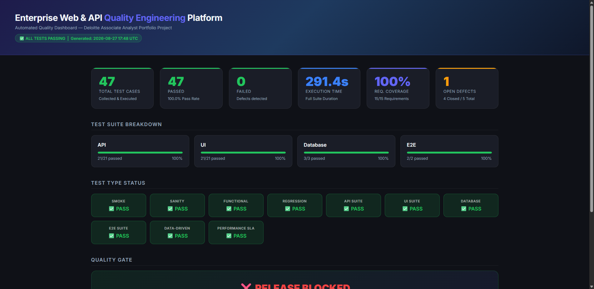
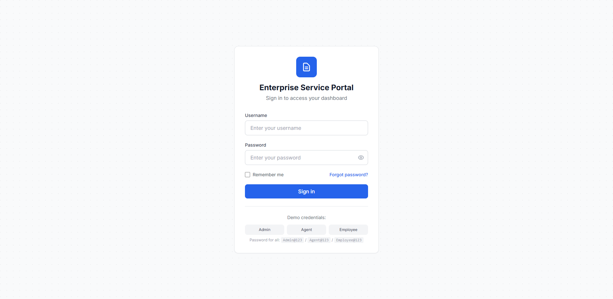
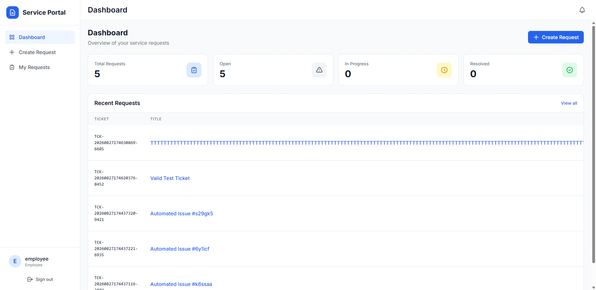
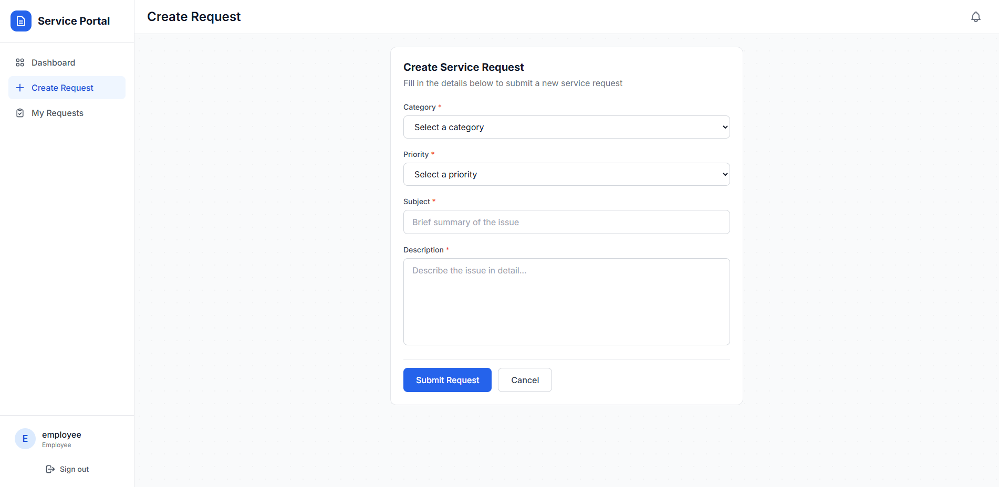

# ServiceFlow — Enterprise Service Request Quality Engineering Platform

[](#quality-engineering-dashboard)
[](#automation-test-suite)
[](https://www.python.org/)
[](https://www.selenium.dev/)
[](https://docs.pytest.org/)
[](#cicd-pipeline)

**ServiceFlow** is an enterprise-grade, multi-tier Service Request & Incident Management platform equipped with a comprehensive Quality Engineering automation framework. Designed for enterprise service management (ITSM), ServiceFlow enables employees to log service tickets, support agents to triage and assign requests, and administrators to track SLAs and system performance.

Built specifically to demonstrate **Quality Engineering excellence** for high-reliability enterprise environments (aligned with Deloitte Quality Engineering standards).

---

## 🏛️ System Architecture

```mermaid
graph TD
    SubGraph1["Client & Automation Layer"]
        UI["Vanilla JS + CSS Frontend (Port 3000)"]
        Selenium["Selenium WebDriver POM Suite"]
        Requests["REST API Test Suite (requests)"]
        Perf["API Performance & SLA Benchmarks"]
    end

    SubGraph2["Application Core Layer"]
        FastAPI["FastAPI REST Services (Port 8000)"]
        JWT["OAuth2 + JWT Auth Engine"]
        SLAEngine["SLA Monitoring & Escalation Service"]
    end

    SubGraph3["Persistence & Analytics Layer"]
        DB[("SQLite / PostgreSQL Database")]
        Dashboard["Dark-Mode Quality Dashboard (HTML5)"]
        JSONLog["ELK-Ready JSON Audit Logs"]
    end

    UI -->|HTTP / REST| FastAPI
    Selenium -->|Browser Action| UI
    Requests -->|REST Calls| FastAPI
    Perf -->|Concurrent Requests| FastAPI
    FastAPI -->|Async SQLAlchemy| DB
    FastAPI -->|JSON Security| JWT
    FastAPI -->|Event Hooks| SLAEngine
    Selenium -->|Execution Logs| Dashboard
    Requests -->|Execution Logs| Dashboard
    FastAPI -->|Structured Log| JSONLog
```

---

## 🖼️ Platform & Quality Dashboard Previews

### 📊 Interactive Dark-Mode Quality Engineering Dashboard


### 🔑 Enterprise Portal Login & Authentication Interface


### 🎟️ Service Request Management Queue


### 📝 Create Service Request Form (POM Encapsulated)



---

## 🚀 Key QE Capabilities & Artifacts

* **Multi-Layer Test Coverage (47 Tests)**:
  * **UI Automation**: Selenium WebDriver with Page Object Model (POM), explicit waits, and element encapsulation.
  * **REST API Automation**: `requests`-based functional, boundary, negative, and payload validation tests.
  * **Database Verification**: `sqlite3`/PostgreSQL direct SQL query validation for FK integrity and state propagation.
  * **End-to-End Cross-Layer (E2E)**: Full UI → API → DB consistency verification.
  * **Performance & SLA Benchmarking**: Automated P95/P99 latency benchmarks and concurrent RPS throughput validation.
  * **Defect Regression Suite**: Automated regression re-testing linked to verified defect fixes.
* **Automated Failure Artifact Capture**: Automatic screenshot generation, browser console log extraction, page HTML snapshotting, and metadata JSON logging on any UI failure.
* **Interactive Quality Dashboard**: Custom dark-mode HTML dashboard (`reports/dashboard/index.html`) generated automatically post-test session.
* **Structured Observability Logging**: ELK-ready JSON audit logging formatted for enterprise log aggregators (`logs/audit_json.log`).
* **Requirements Traceability Matrix (RTM)**: Executable mapping connecting 100% of functional requirements to automated test cases.

---

## 📊 Automation Test Suite Breakdown

| Suite Category | Marker | Test Count | Pass Rate | Key Verification Focus |
| :--- | :--- | :---: | :---: | :--- |
| **API Functional & Smoke** | `@pytest.mark.api` | 9 | 100% | Healthcheck, JWT Login, CRUD operations, RBAC permissions |
| **UI Automation (POM)** | `@pytest.mark.ui` | 11 | 100% | Login Page, Create Request, Ticket List, Responsive Drawer |
| **Database Verification** | `@pytest.mark.database` | 3 | 100% | FK integrity, seed data verification, timestamp constraints |
| **E2E Cross-Layer** | `@pytest.mark.e2e` | 3 | 100% | UI submit → API fetch → DB query single transaction consistency |
| **Schema & Validation** | `@pytest.mark.api` | 12 | 100% | OpenAPI JSON Schema validation, boundary & negative checks |
| **Data-Driven Parametrized**| `@pytest.mark.data_driven` | 4 | 100% | Multi-role authentication & invalid payload combinations |
| **Defect Regression** | `@pytest.mark.defect_regression` | 2 | 100% | Defect DEF-001 (Priority filter) & DEF-002 (Escalate permissions) |
| **Performance SLA** | `@pytest.mark.performance` | 3 | 100% | GET /health P95 < 100ms, Login RPS > 1.0, POST /tickets P99 < 500ms |
| **TOTAL VERIFIED SUITE** | | **47** | **100%** | **COMPLETE QUALITY COVERAGE** |

---

## 🛠️ Tech Stack & Tools

* **Application**: Python 3.11+, FastAPI, SQLAlchemy (Async), SQLite/PostgreSQL, HTML5/Vanilla JS, CSS3.
* **Automation Framework**: PyTest, Selenium WebDriver 4.x, `requests`, `jsonschema`.
* **Design Patterns**: Page Object Model (POM), API Client Abstraction, Strategy Pattern for Config.
* **Observability & Reports**: Custom HTML5 Dashboard, `pytest-html`, `pytest-json-report`, ELK JSON Logging.
* **CI/CD & DevOps**: GitHub Actions, Docker, Docker Compose.

---

## ⚡ Quickstart & Execution

### 1. Prerequisites & Environment Setup
```bash
# Clone repository
git clone https://github.com/Nagesh389292/ServiceFlow-Enterprise-Quality-Engineering-Test-Automation-Platform.git
cd ServiceFlow-Enterprise-Quality-Engineering-Test-Automation-Platform


# Create and activate virtual environment
python -m venv venv
venv\Scripts\activate  # On Windows

# Install dependencies
pip install -r requirements.txt
```

### 2. Start Application Services
```bash
# Terminal 1: Backend API Service (Port 8000)
$env:PYTHONPATH="application/backend"
python -m uvicorn app.main:app --host 127.0.0.1 --port 8000

# Terminal 2: Frontend Web Service (Port 3000)
python -m http.server 3000 --directory application/frontend
```

### 3. Run Automation Suites
```bash
# Run complete 47-test suite with interactive report generation
python -m pytest automation/ -v --json-report --json-report-file=reports/json/results.json

# Run specific suite layers
python -m pytest automation/ -m smoke -v
python -m pytest automation/ -m api -v
python -m pytest automation/ -m ui -v
python -m pytest automation/ -m e2e -v
python -m pytest automation/ -m performance -v
```

### 4. View Quality Engineering Dashboard
Open `reports/dashboard/index.html` in any web browser to view real-time metrics, test breakdowns, requirement coverage, and release quality gate status.

---

## 📄 Portfolio Documentation & Artifacts

* 📜 **[Agile Backlog & Sprint Management](docs/AGILE_BACKLOG.md)**: Sprints 1–5 breakdown, User Stories with Acceptance Criteria, Definition of Done (DoD), and Retrospectives.
* 📋 **[Requirements Traceability Matrix (RTM)](docs/REQUIREMENTS_TRACEABILITY_MATRIX.md)**: Executable mapping of requirements to automated test cases.
* 🐞 **[Defect Lifecycle Register](docs/DEFECT_REGISTER.md)**: Complete defect lifecycle tracking with steps to reproduce and automated regression test mapping.
* 🎬 **[5-Minute Interview Demonstration Guide](docs/DEMO_WALKTHROUGH.md)**: Structured walkthrough script for technical job interviews.
* 💼 **[Resume Highlights](docs/RESUME_HIGHLIGHTS.md)**: Quantified outcomes and engineering bullet points tailored for Deloitte QE roles.
